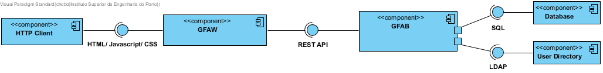
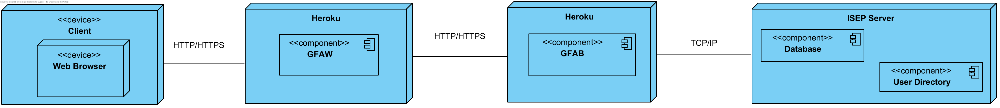

# Iteration 1

**Step 1**

- Goal: Review Inputs

- Possible Questions:

|Question|Answer|
|--------|------|
|Inputs available and correct?|As far as the feedback of the stakeholder, the defined architectural drivers are correct|
|All drivers available?|As far as what was retained from the domain problem and the stakeholder feedback, all drivers have been defined|
|Is it clearly stablished what is the purpose for the design activities?|Yes, the purpose of this iteration is to structure the software architecture in a coarse-view|
|Have primary functionality and quality attribute scenarios been prioritized (ideally by the most important project stakeholders)?|---|
|Are initial architectural concerns defined?|Yes|

**Step 2**

- Goal: Establish iteration goal by selection drivers

#### Kanban Board

| Not Addressed | Partially Addressed | Addressed |
|---------------|---------------------|-----------|
| UC2 |||
| UC3 |||
| UC6 |||
| UC10 |||
| CON-1 ||| 
| CON-4 |||
| CON-5 |||
| CRN-4 |||
| QA-1 |||
| QA-3 |||

**Step 3**

- Goal: Choose elements of the system to refine

As this is the first iteration of a greenfield system, it is necessary to define the first element of the system which is the system itself. The system is composed by four components, which are:

- GFAW (Gorgeous Food Application Web), which is the frontend of GFA, producing a graphic interface that will be consumed by the users. This element represents a SPA (Single Page Application), which consumes GFAB produced functionalities
- GFAB (Gorgeous Food Application Business), which is the backend of GFA, producing an interface that allows the consume of business logic functionalities.
- Database, which produces an interface that allows the store of information
- User Directory Server, which produces an interface that allows the fetch of users information

**Step 4**

- Goal: Choose one or more design concepts that satisfy the selected drivers

Given the iteration goal selected drivers in Step 2, it is necessary to define which design concepts will be taken in account to realize the elements to refine selected in Step 3. The design concents proposed are the following:

- Reference Architectures:
   - Three Layer Application
- Deployment Patterns:
   - 4 Tier Deployment Pattern fits perfectly the requirements for the selected elements to refine
- Architectural Patterns:
   - MVC (Model-View-Controller) architectural pattern which allows a clean separation of responsibilities in GFAB. Model will hold responsibilities regarding business logic functionalities and definitions, while controller handles the produced interface requests as well as any other external component communication. View will have the responsibility to define passive views that represent state of requests and responses using models data.
   - MVVM (ModelView ViewModel) architectural pattern as React.js implies an active view in which the view needs to change its state over the time, using data bindings and computed properties
- Architectural Styles:
  - REST (Representational State Transfer) architectural style will allow the structure of GFAB API by defining collections. Each of these collections represent a domain responsibility and hold resources which are entities of that domain.
  - Client Server as GFAB produces an API ready to be consumed by external clients
  - Component-Based
  - Layer-Architecture
  - SOA (Service Oriented Architecture)
- Technologies and Frameworks:
  - React.JS will allow the build of GFAW
  - .NET Core + Entity Framework will allow the build of GFAB

**Step 5**

- Goal: Instantiate architectural elements, allocate responsibilities and define interfaces

To satisfy the structure of the chosen design concepts, the following elements are proposed to be created:

- Create component-and-connector structures to represent system elements integrations
- Create allocation structures diagram to represent system elements allocations

**Step 6**

- Goal: Sketch views and record design decisions

- Component-and-connector View : 

   **Component Diagram**

   With a component diagram its possible to visualize all components of the system integrations, by representing the interfaces that these produce as well as the consume of these interfaces. GFAB was designed to produce an interface that is represented by a REST API which will allow the consume of the business logic functionalities by GFAW and other components. GFAW also produces an interface that allows the consume of HTML/Javascript/CSS as this a web application. Database and User Directory were designed to produce a SQL and LDAP interface respectively, although these API definitions still need to be refined with the feedback of the stakeholders.

   

- Allocation View :

   **Deployment Diagram**

   With a deployment diagram its possible to visualize the allocation of the system in each tier. For an initial iteration it was decided that HTTP is used over HTTPS as the goal is to create a prototype to demonstrate a set of functionalities to the stakeholders. GFAW component was designed to be deployed on the cloud using [Heroku](https://www.heroku.com) services. GFAB was also designed to be deployed on the cloud using Azure services.

   

**Step 7**

- Goal: Perform analysis of current design and review iteration goal and achivements of design purposes

In this iteration GFA was designed architecturally in a coarse view, which allowed the team to understand the integration of each system component. It was concluded that there are four components, in which two of these need to be developed by the team (GFAW and GFAB). These two components represent the web application which the users will be able to consume the user interface and the business logic functionalities which are consumed by the web application, and will be deployed on the cloud. A set of design concepts were also realized which will architecture these components.

The following table represents the update of the kanban board after the iteration:

| Not Addressed | Partially Addressed | Addressed |
|---------------|---------------------|-----------|
| UC2 |||
| UC3 |||
| UC6 |||
| UC10 |||
||| CON-1 | 
|| CON-4 ||
||| CON-5 |
| CRN-4 |||
||| QA-1 |
| QA-3 |||