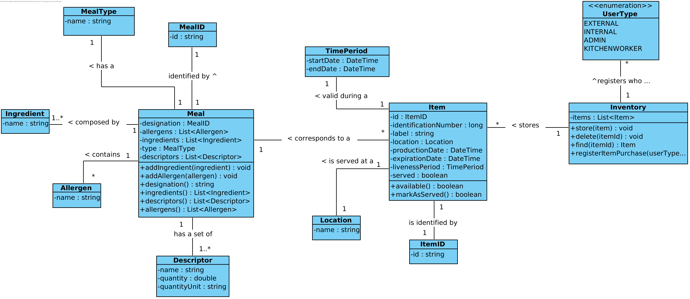
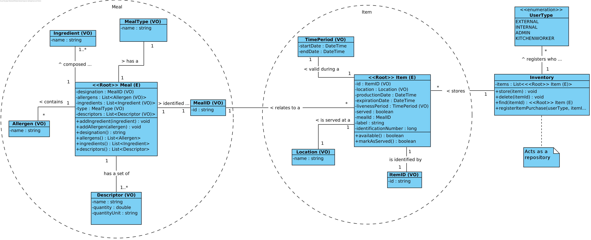
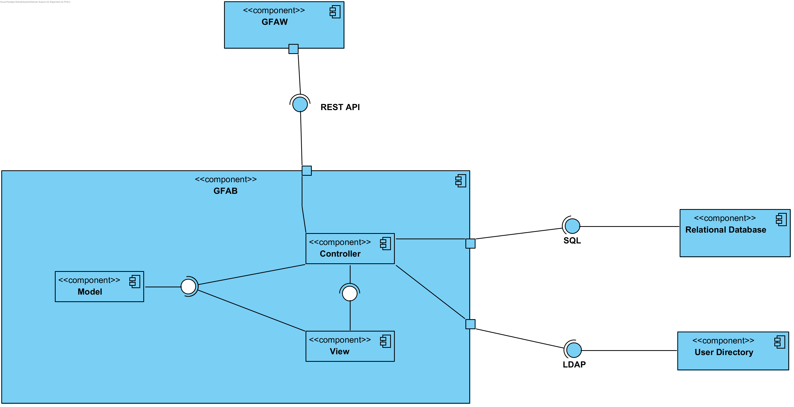
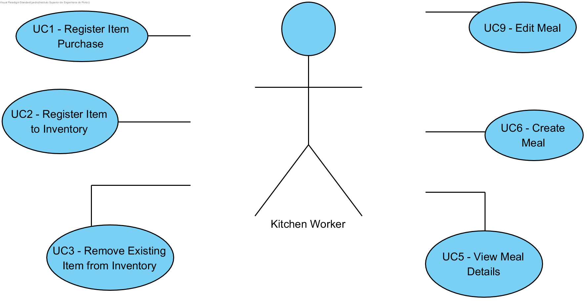

# Iteration 2

**Step 1**

- Goal: Review Inputs

- Possible Questions:

|Question|Answer|
|--------|------|
|Inputs available and correct?|As far as the feedback of the stakeholder, the defined architectural drivers are correct|
|All drivers available?|As far as what was retained from the domain problem and the stakeholder feedback, all drivers have been defined|
|Is it clearly stablished what is the purpose for the design activities?|Yes, the purpose of this iteration is to structure the software architecture in a coarse-view|
|Have primary functionality and quality attribute scenarios been prioritized (ideally by the most important project stakeholders)?| Yes the primary functionalities are related to adding and removing an item to the inventory |
|Are initial architectural concerns defined?|Yes|

**Step 2**

- Goal: Establish iteration goal by selecting drivers

#### Kanban Board

| Not Addressed | Partially Addressed | Addressed |
|---------------|---------------------|-----------|
| UC2 |||
| UC3 |||
| UC5 |||
| UC6 |||
| UC9 |||
| UC11 |||
| UC12 |||
| UC13 |||
| UC10 |||
| CON-4 |||
| CRN-4 |||
| QA-3 |||

**Step 3**

- Goal: Choose elements of the system to refine

The goal of this iteration is to support the primary functionalities of GFA, by designing architecturally the software in a fine grain view. In order to realize this design it is necessary to refine the following elements:

- GFAW (Gorgeous Food Application Web)
- GFAB (Gorgeous Food Application Business)

**Step 4**

- Goal: Choose one or more design concepts that satisfy the selected drivers

Given the iteration goal selected drivers in Step 2, it is necessary to define which design concepts will be taken in account to realize the elements to refine selected in Step 3. The design concents proposed are the following:

- Architectural Patterns:
    - MVC (Model-View-Controller) architectural pattern which allows a clean separation of responsibilities in GFAB. Model will hold responsibilities regarding business logic functionalities and definitions, while controller handles the produced interface requests as well as any other external component communication. View will have the responsibility to define passive views that represent state of requests and responses using models data.
    - MVVM (ModelView ViewModel) architectural pattern for GFAW component, as React.JS implies an active view in which the view needs to change its state over the time, using data bindings and computed properties.

- Adoption of **DDD** in GFAB component, by defining:
    - Aggregate Roots for entities
    - Entities for models that have identity
    - Value Objects for concepts that add value to domain
    - Repositories for aggregate roots
    - Services in order to hide complex domain logic
- Other Design Patterns:
    - Factories (Creational Pattern)

**Step 5**

- Goal: Instantiate architectural elements, allocate responsibilities and define interfaces

To satisfy the structure of the chosen design concepts, the following elements are proposed to be created:

- Domain Model
- Use Case Diagram
- Models Objects Class Diagram
- Aggregate Roots Diagram
- Package Diagram of each GFAB sub-component
- End-To-End Sequence Diagram of a functionality in GFAB component
- Fine-Grain GFAB Components Diagram
- Fine-Grain GFAW Components Diagram
- GFAB REST API Specification

**Step 6**

- Goal: Sketch views and record design decisions

- Module View:

  **Domain Model**

  

  **Model Objects Class Diagram**

  

  **Aggregate Roots Diagram**

  

- Component & Connector View :

 **GFAB_Components**

 

- Allocation View :

  **Use Case Diagram**

Use Cases chosen to implement given the selected drivers:

**Step 7**

- Goal: Perform analysis of current design and review iteration goal and achivements of design purposes