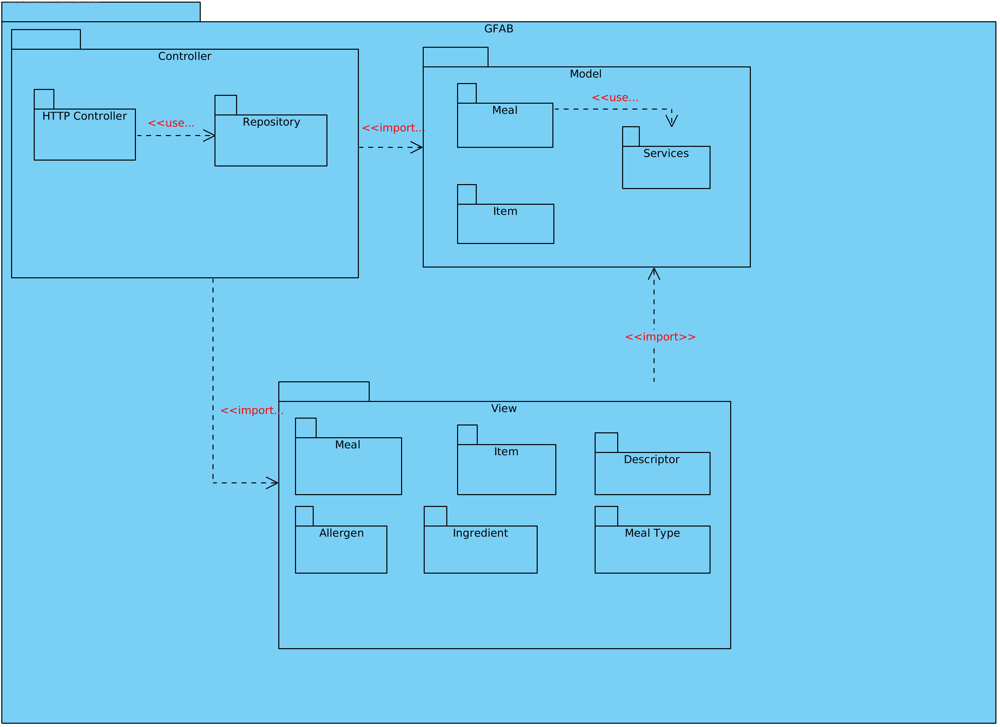

# Iteration 2

**Step 1**

- Goal: Review Inputs

- Possible Questions:

|Question|Answer|
|--------|------|
|Inputs available and correct?|As far as the feedback of the stakeholder, the defined architectural drivers are correct|
|All drivers available?|As far as what was retained from the domain problem and the stakeholder feedback, all drivers have been defined|
|Is it clearly stablished what is the purpose for the design activities?|Yes, the purpose of this iteration is to structure the software architecture in a fine-grain view|
|Have primary functionality and quality attribute scenarios been prioritized (ideally by the most important project stakeholders)?| Yes the primary functionalities are related to adding and removing an item to the inventory |
|Are initial architectural concerns defined?|Yes|

**Step 2**

- Goal: Establish iteration goal by selecting drivers

#### Kanban Board

| Not Addressed | Partially Addressed | Addressed |
|---------------|---------------------|-----------|
| UC1 |||
| UC2 |||
| UC3 |||
| UC4 |||
| UC5 |||
| UC6 |||
| UC9 |||
| CON-4 |||
| CON-6 |||
| CRN-4 |||
| QA-3 |||

**Step 3**

- Goal: Choose elements of the system to refine

The goal of this iteration is to support the primary functionalities of GFA, by designing architecturally the software in a fine grain view. In order to realize this design it is necessary to refine the following elements:

- GFAW (Gorgeous Food Application Web)
- GFAB (Gorgeous Food Application Business)

**Step 4**

- Goal: Choose one or more design concepts that satisfy the selected drivers

Given the iteration goal selected drivers in Step 2, it is necessary to define which design concepts will be taken in account to realize the elements to refine selected in Step 3. The design concents proposed are the following:

|Design Decisions and Location|Rationale|
|-----------------------------|---------|
|Architecturally structure GFAB with the adoption of MVC|MVC (Model-View-Controller) architectural pattern which allows a clean separation of responsibilities in GFAB and GFAW components. Model will hold responsibilities regarding business logic functionalities and definitions, while controller handles the produced interface requests as well as any other external component communication. View will have the responsibility to define passive views that represent state of requests and responses using models data. This satisfies all requirements necessary to produce use cases functionalities, from a server side perspective (UC1, UC2, UC3, UC5 and UC6).|
|Architecturally structure GFAW using the *community standard*|The React.JS community commonly does not adopt any standard architectural pattern such as MVC or MVP. It will be used an architecture similar to MVC in terms of terminologies, in which there are three components, Model, View and Controller. Model has the responsibility to create Javascript objects related to business concepts. Controller handles external components communications such as http requests. View is the presentation, handles user events and uses controller to perform any external communication|
|Separate business responsibilities by structuring GFAB with the use of DDD and other patterns|The adoption of DDD in GFAB allows to separate business responsibilities. The patterns to adopted are: Aggregate Root, Entity, Value Object, Repository, Service. Repository pattern should also be complemented with Factory creational pattern as the controller is agnostic of what repository implementation to use|

|Alternative|Reason for Discarding|
|-----------|---------------------|
|MVP (Model View Presenter) architectural pattern for GFAB|MVP implies that the view can only communicate with the controller, where the presenter acts as a controller interacting with the model directly. Using this architectural pattern would require the controller to have the responsibility to know how to build the view using model|

**Step 5**

- Goal: Instantiate architectural elements, allocate responsibilities and define interfaces

To satisfy the structure of the chosen design concepts, the following elements are proposed to be created:

|Design Decisions and Location|Rationale|
|-----------------------------|---------|
|Elaborate domain model|Domain model allows the identification of business concepts, which are necessary to address the selected drivers (UC1, UC2, UC3, UC5, UC6, UC9, CON-4, CON-6, CRN-4, QA-3)|
|Elaborate use cases by actors|To establish actors and their responbilities it is necessary to map the use cases being addressed by their actors|
|Map use cases to domain objects|Domain objects of use cases help in identifying the dependencies existent for each use case|
|Define models interface|It is necessary to explicit models objects interfaces in order to understand how models communicate with each other as well as how their functionalities are produced. This will not only help to understand how use cases affect model objects, but also constraints related to item identification number generation and user logs/activities (CON-7, CON-8, CON-11|
|Decompose GFAB and GFAW in small modules|To explicit all dependencies existent in each component it is necessary to decompose the components in smaller modules|
|Map domain model using DDD|This helps understanding how DDD should be applied in GFAB|
|Elaborate GFAB REST API|To explicit the specification of the produced functionalities so consumers can understand how requests and responses are performed and structured|
|Explicit sequence of REST API functionalities in GFAB component|To understand the flux of each module interaction each time a functionality is requested|

**Step 6**

- Goal: Sketch views and record design decisions

#### Module View:

  **Domain Model**

  

  **Model Objects Class Diagram**

  

  **Aggregate Roots Diagram**

  

  **GFAB Packages Diagram**

  

#### Component & Connector View :

 **GFAB Components Diagram Fine-Grain View**

 

 **GBAW Components Diagram Fine-Grain View**
 
 

#### Allocation View :

  **Use Case Diagram**

Use Cases chosen to implement given the selected drivers:

  **Domain Objects for Use Cases**

- GFAB REST API Specification

The REST API specification produced by GFAB can be found [here](rest_api/README.md).

- Responsability Table for Defined Elements

|Element|Responsibility|
|-------|--------------|
|HTTP Controller|Produces controllers that handle all REST API requests|
|Repository|Produce interfaces (and their implementations) for aggregate roots objects management functionalities (Store, Update, Find and Delete)|
|Meal (View)|Explicits all model views that are related to `meal` collection produced by the REST API|
|Item (View)|Explicits all model views that are related to `item` collection produced by the REST API|
|Allergen (View)|Explicits all model views that are related to `allergens` collection produced by the REST API|
|Ingredient (View)|Explicits all model views that are related to `ingredients` collection produced by the REST API|
|Descriptor (View)|Explicits all model views that are related to `descriptors` collection produced by the REST API|
|Meal Type (View)|Explicits all model views that are related to `mealtypes` collection produced by the REST API|
|Meal (Model)|Produces models and functionalities related to `meal` aggregate root|
|Item (Model)|Produces models and functionalities related to `item` aggregate root|
|Services (Model)|Produces domain services used by model objects|
|Model (GFAB C&C)|Produces an interface that explicits model objects functionalities|
|View (GFAB C&C)|Produces an interface that explicits model views represented in the REST API|
|Controller (GFAB C&C)|Handles REST API requests and external components communication|
|Model (GFAW C&C)|Produces an interface that explicits model objects|
|View (GFAW C&C)|Produces an interface that explicits the presentation that the user consumes and handles any user interaction|
|Controller (GFAW C&C)|Handles external components communication|

**Step 7**

- Goal: Perform analysis of current design and review iteration goal and achivements of design purposes

In this iteration GFA was designed architecturally in a fine-grain view, which allowed the team to understand how each component units were being integrated.
A domain model was sketched which allowed to understand the business concepts that exist in GFA. Consecutively a class diagram for the models that represent this business concepts was realized, allowing the representation of the functionalities that these produced, as well as their properties.
It was concluded that the adoption of DDD in GFAB allowed a clean separation of responsibilities, which eases the development process of the component. The definition of the REST API specification produced by GFAB permits the development of GFAW as GFAB is also being developed, as the consumers already now the interface specifications that is being consumed.

The following table represents the update of the kanban board after the iteration:

| Not Addressed | Partially Addressed | Addressed |
|---------------|---------------------|-----------|
||UC1||
|||UC2|
|||UC3|
||UC4||
|||UC5|
|||UC6|
|UC9|||
|||CON-4|
|||CON-6|
|CRN-4|||
|QA-3|||