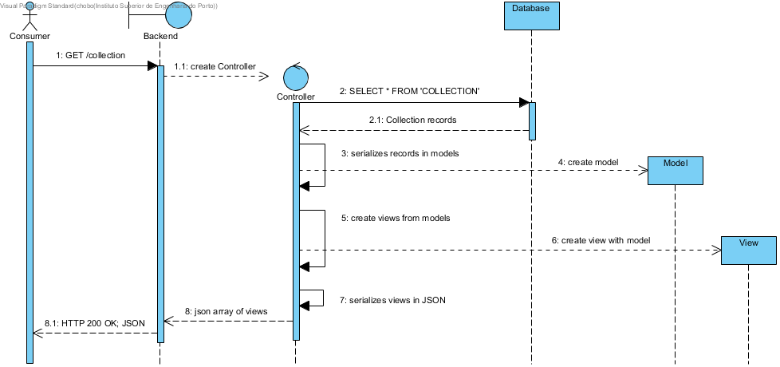
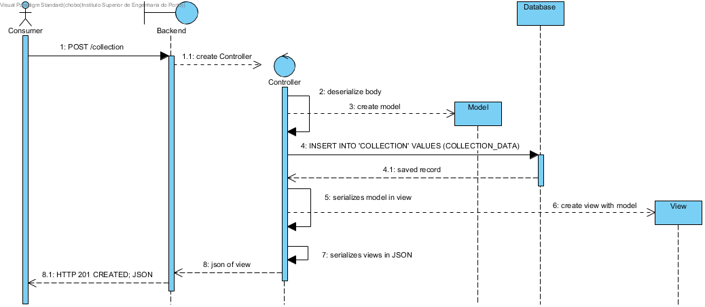
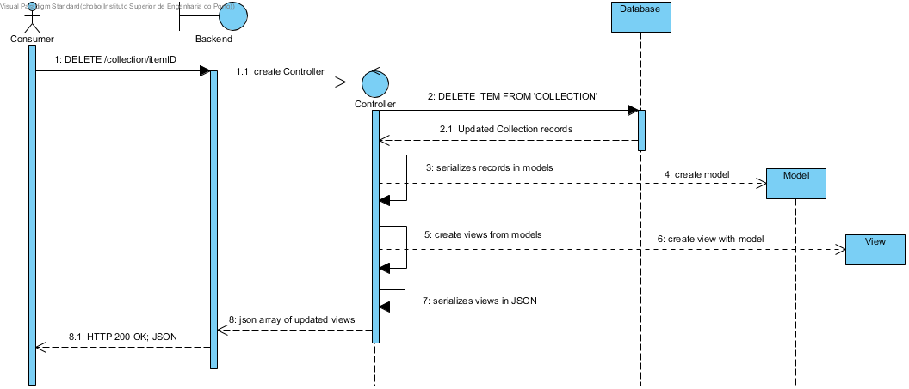

# Entrypoint

GFAB REST API entrypoint is located at the following URI `/api`

## Functionalities

Produced functionalities can be found in the table below. Consumers can interact directly with two collections (`meals` and `items`) as they are both the existent root aggregators of all GFA. Collections `allergens`, `descriptors`, `ingredients` and `mealtypes` are also available and allow the consume of the available valid data that can be specified on meals creation.

-----------

|Verb|URI|Description|
|----|---|-----------|
|GET|[/meals](meals/available_meals.md)|Retrieves available meals|
|GET|[/meals/:id](meals/detailed_meal_information.md)|Retrieves detailed information of a meal|
|POST|[/meals](meals/create_meal.md)|Creates a meal|
|POST|[/items](items/add_item.md)|Add item to inventory|
|DELETE|[/items/:id](items/remove_item.md)|Remove item from inventory|
|GET|[/allergens](allergens/available_allergens.md)|Retrieves available allergens that a meal may contain|
|GET|[/ingredients](ingredients/available_ingredients.md)|Retrieves available ingredients that can be composed by a meal|
|GET|[/descriptors](descriptors/available_descriptors.md)|Retrieves available descriptors that can be applied to a meal|
|GET|[/mealtypes](mealtypes/available_mealtypes.md)|Retrieves available meal types|

## Generic CRUD behaviour within the GFAB component

**Get**

  

**Post**

  

**Delete**

  