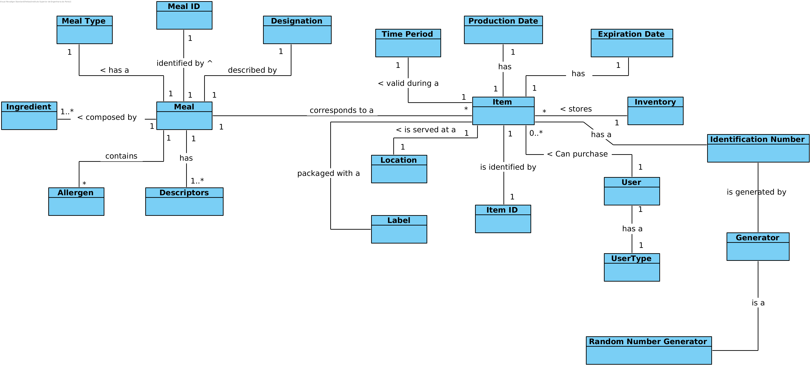
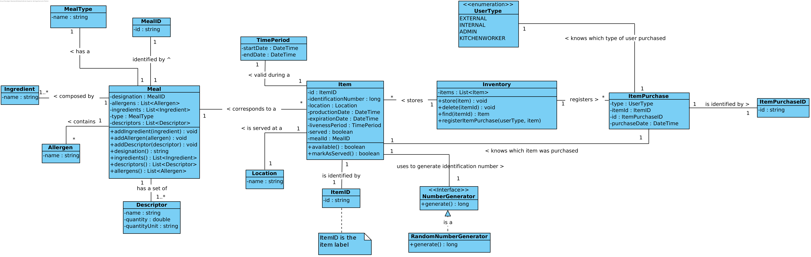
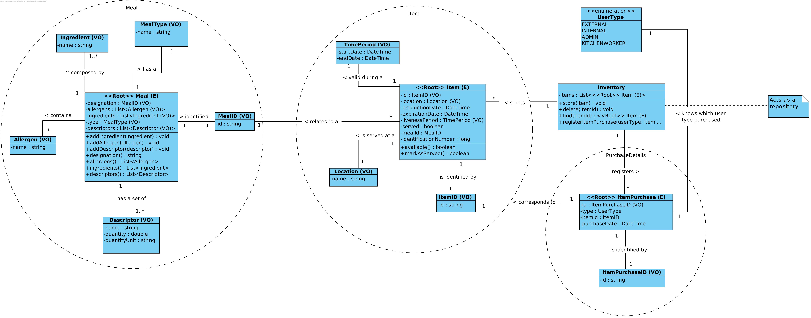
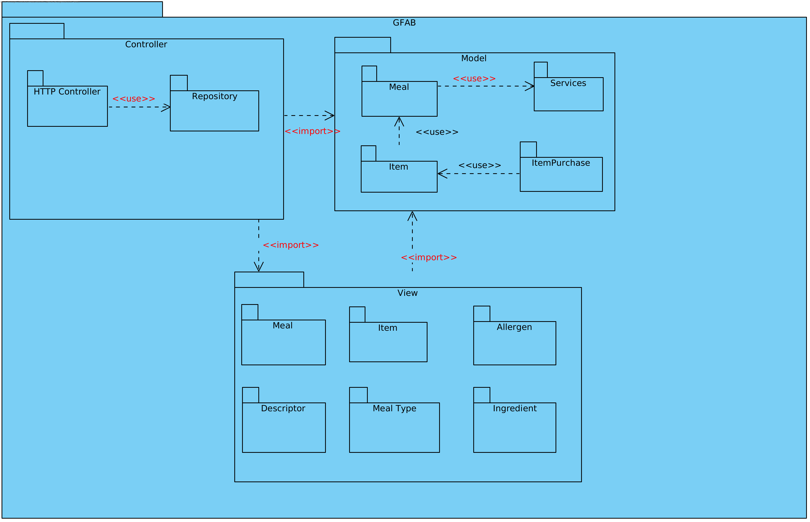
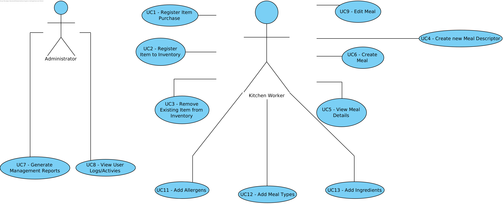
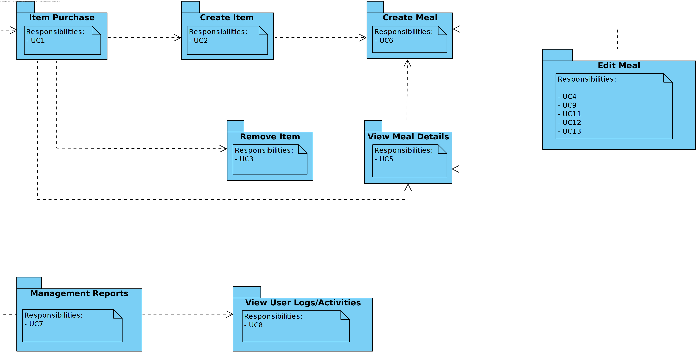

# Iteration 3

**Step 1**

- Goal: Review Inputs

- Possible Questions:

|Question|Answer|
|--------|------|
|Inputs available and correct?|As far as the feedback of the stakeholder, the defined architectural drivers are correct|
|All drivers available?|As far as what was retained from the domain problem and the stakeholder feedback, all drivers have been defined|
|Is it clearly stablished what is the purpose for the design activities?|Yes, the purpose of this iteration is to structure the software architecture with the remaining not or partially addressed use cases and remaining drivers|
|Have primary functionality and quality attribute scenarios been prioritized (ideally by the most important project stakeholders)?| Yes the primary functionalities are related to adding and removing an item to the inventory |
|Are initial architectural concerns defined?|Yes|

**Step 2**

- Goal: Establish iteration goal by selecting drivers

#### Kanban Board

| Not Addressed | Partially Addressed | Addressed |
|---------------|---------------------|-----------|
| UC1 |||
| UC4 |||
| UC7 |||
| UC8 |||
| UC9 |||
| UC11 |||
| UC12 |||
| UC13 |||
| CON-7 |||
| CON-8 |||
| CON-11 |||
| CON-12 |||
| CRN-4 |||
| QA-3 |||

**Step 3**

- Goal: Choose elements of the system to refine

The goal of this iteration is to support the remaining functionalities of GFA and auditing concerns, constraints and drivers, by designing architecturally the software in a fine grain view. In order to realize this design it is necessary to refine the following elements:

- GFAB (Gorgeous Food Application Business)

**Step 4**

- Goal: Choose one or more design concepts that satisfy the selected drivers

Given the iteration goal selected drivers in Step 2, it is necessary to define which design concepts will be taken in account to realize the elements to refine selected in Step 3. The design concents proposed are the following:

|Design Decisions and Location|Rationale|
|-----------------------------|---------|
|Separate business responsibilities by structuring GFAB with the use of DDD and other patterns|The adoption of DDD in GFAB allows to separate business responsibilities. The patterns to be adopted are: Aggregate Root, Entity, Value Object, Repository, Service. Repository pattern should also be complemented with Factory creational pattern as the controller is agnostic of what repository implementation to use|
|Use strategy pattern to design item identification number generation|Strategy pattern helps expliciting functionalities with multiple implementations, while being agnostic of these implementations. This will provide support for CON-8|
|Use service that allows the request of an item identification number generator|This service will create an indirection between the requester and the concrete implementation of the generator, so that the requester does not need to know which generator concretization is being applied|
|Use `serilog` to capture and handle user activity logs|The use of a well tested structured logging technology will provide support for UC7, UC8, CON-11, CRN-4 and QA-3|

|Alternative|Reason for Discarding|
|-----------|---------------------|
|Logging technologies for .NET|There are other logging technologies such as `log4net` and `NLog`. The reason the team excludes these alternatives is that `serilog` focuses primarly on [structured logging](https://serilog.net/) and is the technology that is [most used (as of 10/11/2019)](https://www.nuget.org/stats/packages) by the .NET community|

**Step 5**

- Goal: Instantiate architectural elements, allocate responsibilities and define interfaces

To satisfy the structure of the chosen design concepts, the following elements are proposed to be created:

|Design Decisions and Location|Rationale|
|-----------------------------|---------|
|Refine domain model|Domain model allows the identification of business concepts, and needs to be updated to include selected drivers chabges(UC1, UC4, UC7, UC8, UC9, UC11, UC12, UC13, CON-7, CON-8, CON-11, CON-12, CRN-4, QA-3)|
|Refine use cases actors|To establish actors and their responbilities it is necessary to map the use cases being addressed by their actors|
|Map use cases to domain objects|Use cases can help creating domain objects that have these as their responsibilities|
|Define models interface|It is necessary to explicit models objects interfaces in order to understand how models communicate with each other as well as how their functionalities are produced. This will not only help to understand how use cases affect model objects, but also constraints related to item identification number generation and user logs/activities (CON-7, CON-8, CON-11)|
|Refine DDD map of domain model|Previously DDD map of the domain model needs to be updated as the introduction of new selected drivers change the existent business concepts|
|Refine GFAB REST API|Introduction of new selected drivers imply changes in the existing REST API specification|

**Step 6**

- Goal: Sketch views and record design decisions

- Module View:

  **Domain Model**

  

  **Model Objects Class Diagram**

  

  **Aggregate Roots Diagram**

  

  **GFAB Packages Diagram**

  

- Allocation View :

  **Use Case Diagram**

Use Cases chosen to implement given the selected drivers:

  **Domain Objects for Use Cases**

- GFAB REST API Specification
The [REST API](rest_api/README.md) specification produced by GFAB was refined to include support for drivers UC1, UC4, UC8, UC11, UC12, UC13 and CON-11.

- Responsability Table for Defined Elements

|Element|Responsibility|
|-------|--------------|
|Item Purchase (Model)|Produces models and functionalities related to `item purchase` aggregate root|

**Step 7**

- Goal: Perform analysis of current design and review iteration goal and achivements of design purposes

This iteration focused on providing architecture support for remaining use cases that were not or partially addressed as well as other concerns, constrains and quality attributes that are related to user auditing. The software is now designed to support user activity logging, yet the generation of management reports still needs to be rediscussed with the stakeholders. CON-7 is now supported as it was designed that the school database will also store purchase details.

The following table represents the update of the kanban board after the iteration:

| Not Addressed | Partially Addressed | Addressed |
|---------------|---------------------|-----------|
|||UC1|
|||UC4|
||UC7||
|||UC8|
||UC9||
|||UC11|
|||UC12|
|||UC13|
|||CON-7|
|||CON-8|
|||CON-11|
||CON-12||
|||CRN-4|
||QA-3||