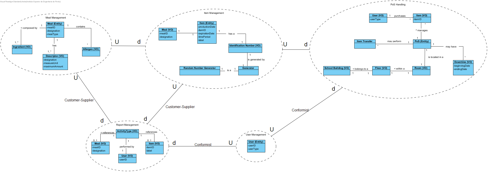
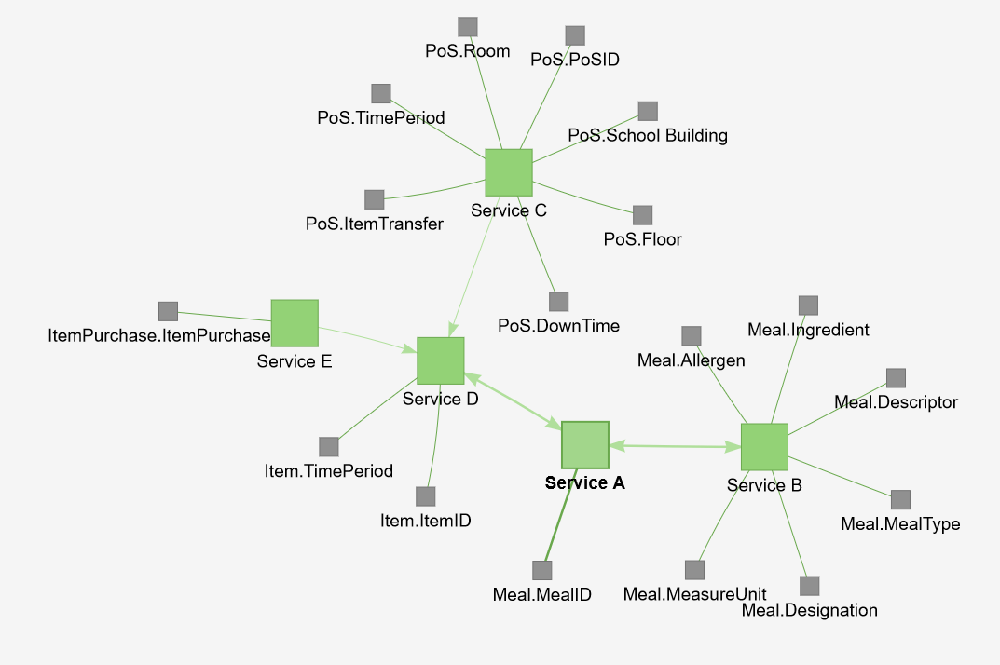

# Iteration 1

**Step 1**

- Goal: Review Inputs

- Possible Questions:

|Question|Answer|
|--------|------|
|Inputs available and correct?|As far as the feedback of the stakeholder, the defined architectural drivers are correct|
|All drivers available?|As far as what was retained from the domain problem and the stakeholder feedback, all drivers have been defined|
|Is it clearly established what is the purpose for the design activities?|Yes, the purpose of this iteration is to decompose the existing monolithic application into various microservices|
|Is existing architecture design available?|Yes, the decisions regarding the decomposition of the monolithic application will be made based on the previously designed architecture|
|Have primary functionality and quality attribute scenarios been prioritized (ideally by the most important project stakeholders)?|---|
|Are initial architectural concerns defined?|Yes|

**Step 2**

- Goal: Establish iteration goal by selecting drivers

#### Kanban Board

| Not Addressed | Partially Addressed | Addressed |
|---------------|---------------------|-----------|
|UC-14|||
|UC-15|||
|UC-16|||
|UC-17|||
|UC-18|||
|UC-19|||
|CON-13|||
|CON-14|||
|CON-15|||
|CON-16|||
|CON-17|||
|CON-18|||
|QA-4|||

**Step 3**

- Goal: Choose elements of the system to refine

Since we are working on a brownfield system, the main focus of this iteration is to support the new functionalities of the pre-existing GFAB component and split it into various microservices.

**Step 4**

- Goal: Choose one or more design concepts that satisfy the selected drivers

Given the iteration goal selected drivers in Step 2, it is necessary to define which design concepts will be taken in account to realize the elements to refine selected in Step 3. The design concepts proposed are the following:

|Design Decisions and Location|Rationale|
|-----------------------------|---------|
|Decompose the existing monolithic application by Business Capabilities|It is necessary to distinguish the GFAB business processes, and create a service to support each of its main functionalities|
|Decompose the existing monolithic application by its Subdomains (Bounded Contexts)|For this approach we must split the GFAB domain into multiple smaller domains, each corresponding to a different business area.|
|Decompose the existing monolithic application with a supporting tool|For this approach we supply an external tool with the GFAB main concerns as input. The tool then outputs a possible decomposition into various services.|

**Step 5**

- Goal: Instantiate architectural elements, allocate responsibilities and define interfaces

To satisfy the structure of the chosen design concepts, the following elements are proposed to be created:

|Design Decisions and Location|Rationale|
|-----------------------------|---------|
|Shared Database|In this solution services share a common database; a service publishes its data, and other services can consume it when required. The Shared Database option could be viable only if the integration complexity or related challenges of Database per Service-based services become too difficult to handle; also, operating a single Shared Database is simpler.|

Alternatives: 
|Design Decisions and Location|Rationale|
|-----------------------------|---------|
|Database Per Service|Keep each microservice's persistence data private to the service and acessible only via its API. The service’s database is not accessible directly by other services.|
|API Composition|The application performs the join rather than the database. For example, a service (or the API gateway) could retrieve a customer and their orders by first retrieving the customer from the customer service and then querying the order service to return the customer’s most recent orders.|
|Command Query Responsibility Segregation (CQRS)|By following this design pattern, we can separate data-update versus data-querying capabilities into separate models. Maintaining one or more materialized views that contain data from multiple services. The views are kept by services that subscribe to events that each services publishes when it updates its data.|
|Database View|With a view, a service can be presented with a schema that is a limited projection from an underlying schema- we limit the data that is visible to the service. It gives us control over what is shared, and what is hidden.|
|Change Data Capture|With change data capture, rather than trying to intercept and act on calls made into the monolith, we react to changes made in a datastore. For change data capture to work, the underlying capture system has to be coupled to the monolith’s datastore.|

**Step 6**

- Goal: Sketch views and record design decisions

#### Business Capabilities Decomposition: 

   **Business Capabilities Decomposition Diagram**

  

#### Sub-Domain Decomposition:

   **Sub-Domain Decomposition Diagram**

   

#### Service Cutter Decomposition:

   **Service Cutter Decomposition Diagram**

   

**Step 7**

- Goal: Perform analysis of current design and review iteration goal and achivements of design purposes

