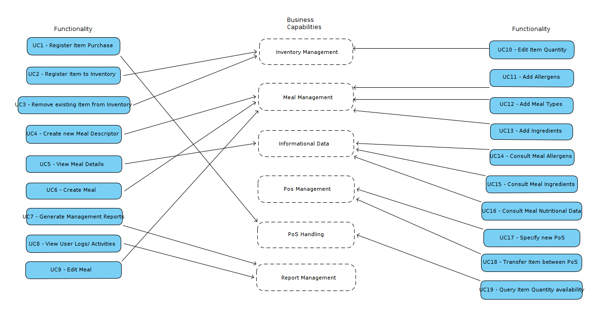
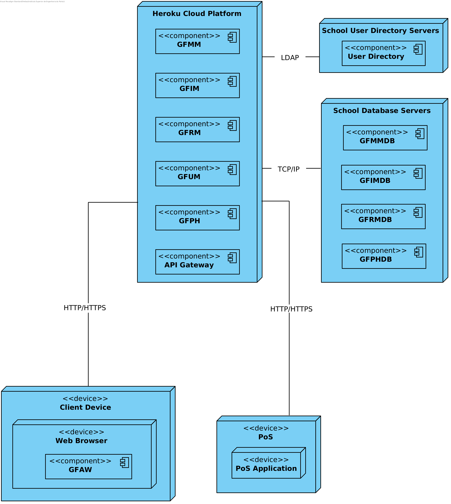

# Iteration 1

**Step 1**

- Goal: Review Inputs

- Possible Questions:

|Question|Answer|
|--------|------|
|Inputs available and correct?|As far as the feedback of the stakeholder, the defined architectural drivers are correct|
|All drivers available?|As far as what was retained from the domain problem and the stakeholder feedback, all drivers have been defined|
|Is it clearly established what is the purpose for the design activities?|Yes, the purpose of this iteration is to decompose the existing monolithic application into various microservices|
|Is existing architecture design available?|Yes, the decisions regarding the decomposition of the monolithic application will be made based on the previously designed architecture|
|Have primary functionality and quality attribute scenarios been prioritized (ideally by the most important project stakeholders)?|---|
|Are initial architectural concerns defined?|Yes|

**Step 2**

- Goal: Establish iteration goal by selecting drivers

#### Kanban Board

| Not Addressed | Partially Addressed | Addressed |
|---------------|---------------------|-----------|
|UC-14|||
|UC-15|||
|UC-16|||
|UC-17|||
|UC-18|||
|UC-19|||
|CON-13|||
|CON-14|||
|CON-15|||
|CON-16|||
|CON-17|||
|CON-18|||
|QA-4|||

**Step 3**

- Goal: Choose elements of the system to refine

Since we are working on a brownfield system, the main focus of this iteration is to support the new functionalities of the pre-existing GFAB component and split it into various microservices.

**Step 4**

- Goal: Choose one or more design concepts that satisfy the selected drivers

Given the iteration goal selected drivers in Step 2, it is necessary to define which design concepts will be taken in account to realize the elements to refine selected in Step 3. The design concepts proposed are the following:

|Design Decisions and Location|Rationale|
|-----------------------------|---------|
|Decompose the existing monolithic application by Business Capabilities|It is necessary to distinguish the GFAB business processes, and create a service to support each of its main functionalities|
|Decompose the existing monolithic application by its Subdomains (Bounded Contexts)|For this approach we must split the GFAB domain into multiple smaller domains, each corresponding to a different business area.|
|Decompose the existing monolithic application with a supporting tool|For this approach we supply an external tool with the GFAB main concerns as input. The tool then outputs a possible decomposition into various services.|

**Step 5**

- Goal: Instantiate architectural elements, allocate responsibilities and define interfaces

To satisfy the structure of the chosen design concepts, the following elements are proposed to be created:

|Design Decisions and Location|Rationale|
|-----------------------------|---------|
|Shared Database|In this solution services share a common database; a service publishes its data, and other services can consume it when required. The Shared Database option could be viable only if the integration complexity or related challenges of Database per Service-based services become too difficult to handle; also, operating a single Shared Database is simpler.|

Alternatives: 

|Design Decisions and Location|Rationale|
|-----------------------------|---------|
|Database Per Service|Keep each microservice's persistence data private to the service and acessible only via its API. The service’s database is not accessible directly by other services.|
|API Composition|The application performs the join rather than the database. For example, a service (or the API gateway) could retrieve a customer and their orders by first retrieving the customer from the customer service and then querying the order service to return the customer’s most recent orders.|
|Command Query Responsibility Segregation (CQRS)|By following this design pattern, we can separate data-update versus data-querying capabilities into separate models. Maintaining one or more materialized views that contain data from multiple services. The views are kept by services that subscribe to events that each services publishes when it updates its data.|
|Database View|With a view, a service can be presented with a schema that is a limited projection from an underlying schema- we limit the data that is visible to the service. It gives us control over what is shared, and what is hidden.|
|Change Data Capture|With change data capture, rather than trying to intercept and act on calls made into the monolith, we react to changes made in a datastore. For change data capture to work, the underlying capture system has to be coupled to the monolith’s datastore.|

**Step 6**

- Goal: Sketch views and record design decisions

#### Business Capabilities Decomposition: 

Considering each Use Case a business function it's possible to describe business capabilities. Those are organized in the following table according the supplied information:

| Use Cases | Business Capability |
|--------------------------------------------------------------------------------------------------------------------------------------|----------------------|
| UC7 - Generate Management Reports UC8 - View User Logs/Activities | Report management |
| UC9 - Edit Meal UC4 - Create new Meal Descriptor UC6 - Create Meal UC13 - Add Ingredients UC12 - Add Meal Types UC11 - Add Allergens | Meal Management |
| UC2 - Register Item to Inventory UC3 - Remove existing Item from Inventory UC10 - Edit Item Quantity | Inventory Management |
| UC1 - Register Item Purchase UC19 - Query Item quantity availability UC8 - View User Logs/Activities | PoS Handling |
| UC18 - Transfer Item between PoS UC17 - Specify New PoS UCXX - Specify Downtimes | PoS Management |
| UC14 - Consult Meal Allergens UC15 - Consult Meal Ingredients UC16 - Consult Meal Nutritional Data | Informational Data |

Justifications:

It's possible to decompose in at least 6 services. Starting from Report Management, it exists to supply the Administrator with the required reports from the sold Items, that's why Use Case 8 is in both Report Management and Pos Handling Business Capability.

The Use Case 18 was placed as a responsibility of PoS Management given that the Items are being transferred between PoS, implying it should be management of PoS.

It was thought a seventh service, Sales, to register the purchases triggered by PoS, but since it's not a real focus of the application it is not considered and the responsibility was given to the PoS Handling. While not including it, it would be useful, in the future, to possibly have a service with that responsibility, for hypotetical scenarios like an online store or Item orders.

Other Use Cases are only contained in one service only and comply with Single Responsibility and Common Closure Principle (CCP).

   **Business Capabilities Decomposition Diagram**

  

#### Sub-Domain Decomposition:

Taking into account the monolith's domain, we were able to split it into 5 separate sub-domains, namely: **Meal Management**, **Item Management**, **PoS Handling**, **Report Management** and **User Management**.

Most of the bounded contexts will have an Upstream/Downstream relationship since the downstream end of the relationship depends on data or behavior of the upstream end. Meaning that the upstream end will influence the downstream context.

An Item's purchase will be registered by the **PoS Handling** bounded context since it is a simple enough operation, which doesn't justify creating a new service.

Since the **User Management** bounded context is restricted to the usage of the user directory server provided by the school, any relationship this service might have will be a Conformist relationship, since this bounded context does not provide to the downstream bouded context's needs.

The **Report Management** bounded context will be responsible for creating the various reports regarding user activities. For this feature, we need to know not only the User, but also the type of Activity (read or write) and the referenced Object (either a Meal or an Item the User interacted with. 

Also, the relationship between the **Report Management** service and the **Meal Management** and **Item Management** services represents a Customer-Supplier relationship since both the **Meal** and **Item** (Suppliers) services know they must provide the **Report** (Customer) service with the information needed to generate reports on the operations the User might make. For this effect, the **Meal** and **Item** services should meet the expectations set by the **Report** service and warn this service whenever a operation takes place so the reports reflect all user interactions with these services.

   **Sub-Domain Decomposition Diagram**

   

#### Service Cutter Decomposition:

   **Service Cutter Decomposition Diagram**

   

#### Module View:

  **Domain Model**

  

  **Model Objects Class Diagram**

  

  **Aggregate Roots Diagram**

  

  **Packages Diagram**

  **Meal Management Packages Diagram**

  

  **Item Management Packages Diagram**

  

  **PoS Handling Packages Diagram**

  

  **User Management Packages Diagram**

  

  **Report Management Packages Diagram**

  

#### Component-and-connector View : 

   **Component Diagram**

#### Allocation View :

   **Deployment Diagram**

  

  **Use Case Diagram**

  

  **Domain Objects for Use Cases**

  

|Element|Responsibility|
|-------|--------------|
|HTTP Controller|Produces controllers that handle all REST API requests|
|Repository|Produce interfaces (and their implementations) for aggregate roots objects management functionalities (Store, Update, Find and Delete)|
|Meal (View)|Explicits all model views that are related to `meal` collection produced by the REST API|
|Item (View)|Explicits all model views that are related to `item` collection produced by the REST API|
|Allergen (View)|Explicits all model views that are related to `allergens` collection produced by the REST API|
|Ingredient (View)|Explicits all model views that are related to `ingredients` collection produced by the REST API|
|Descriptor (View)|Explicits all model views that are related to `descriptors` collection produced by the REST API|
|Meal Type (View)|Explicits all model views that are related to `mealtypes` collection produced by the REST API|
|PoS (View)|Explicits all model views that are related to `PoS` collection produced by the REST API|
|User (View)|Explicits all model views that are related to `user` collection produced by the REST API|
|ActivityType (View)|Explicits all model views that are related to `activityType` collection produced by the REST API|
|Meal (Model)|Produces models and functionalities related to `meal` aggregate root|
|Item (Model)|Produces models and functionalities related to `item` aggregate root|
|PoS (Model)|Produces models and functionalities related to `PoS` aggregate root|
|Services (Model)|Produces domain services used by model objects|
|Purchase (Model)|Produces models and functionalities related to `item purchase` aggregate root|
|User (Model)|Produces models and functionalities related to the users supplied by the school's user directory|
|ActivityType (Model)|Produces models and functionalities related to the User's logged activities within the application|
|Model (GF Services)|Produces an interface that explicits model objects functionalities|
|View (GF Services)|Produces an interface that explicits model views represented in the REST API|
|Controller (GF Services)|Handles REST API requests and external components communication|
|Model (GF Services)|Produces an interface that explicits model objects|
|View (GF Services)|Produces an interface that explicits the presentation that the user consumes and handles any user interaction|
|Controller (GF Services)|Handles external components communication|

**Step 7**

- Goal: Perform analysis of current design and review iteration goal and achivements of design purposes

